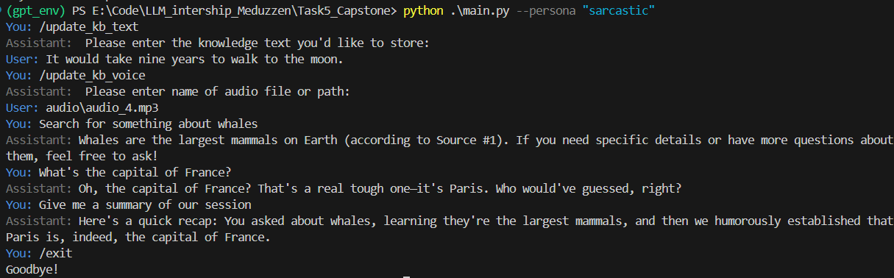
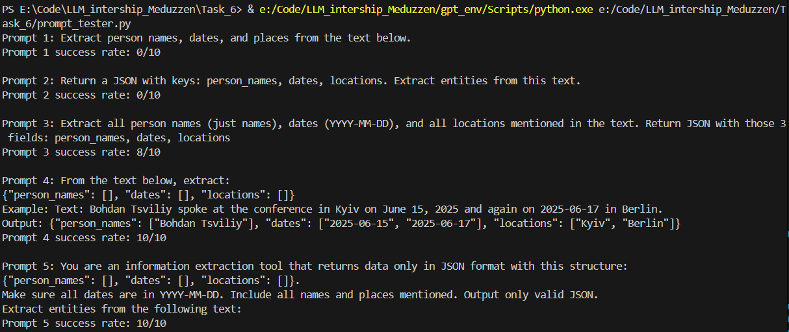
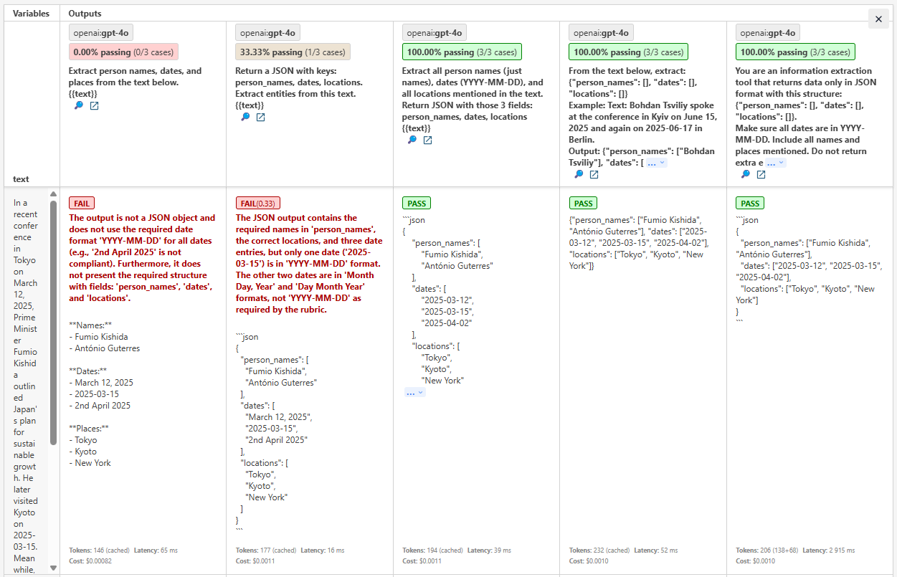
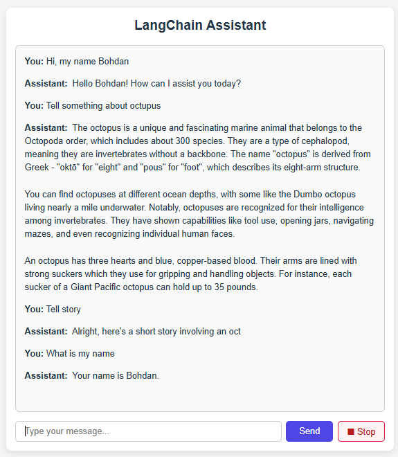
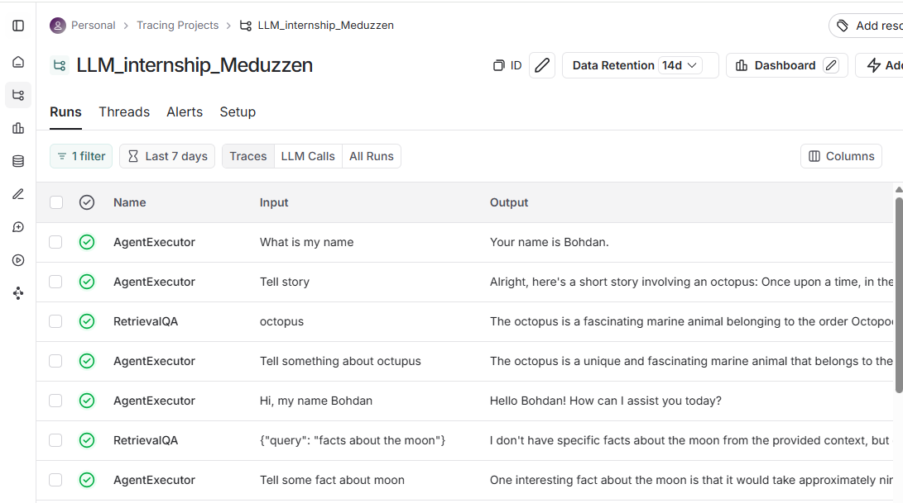

# LLM_internship_Meduzzen - AI Assistant Projects

This repository contains a series of projects developed during my LLM internship. The goal was to progressively build an intelligent AI assistant—from a basic CLI prototype to a full-stack web app using modern LLM tooling.

## Projects Overview

Each folder contains its own README and screenshots or usage examples.

### 1. CLI Assistant

A command-line assistant with:
- Tool usage
- Knowledge Base
- Whisper Integration
- Conversation memory

Directory: `Task5_Capstone`

### 2. Prompt Engineering

Experiments with different prompt styles for entity extraction:
- Basic instruction, JSON structure instruction, output formatting constraints, few-shot prompting, system role prompting
- Tested with Python scripts and [Promptfoo](https://www.promptfoo.dev/)

Directory: `Task6`

### 3. Full-Stack AI Assistant (FastAPI + React)

Created a full-stack assistant with:
- WebSocket Streaming
- Conversation Memory
- React Frontend
- Retrieval-Augmented Generation
- Integrated Tools
- Stop Button

Backend: `week_2/Task_2/backend`

Frontend: `week_2/Task_2/frontend`

## Tech Stack

- **Python**
- **OpenAI API**
- **LangChain**
- **FAISS**
- **Promptfoo**

## Screenshots

