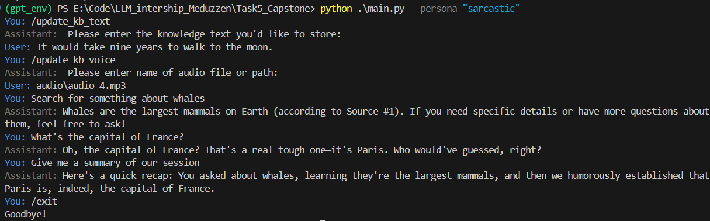
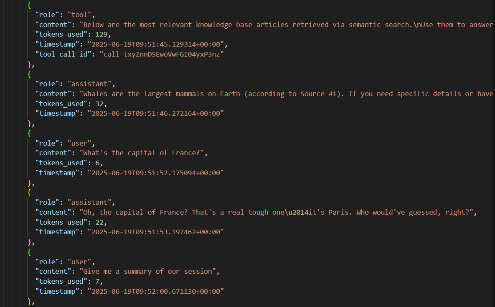

# CLI AI Assistant with Memory, Tools, and Audio/Text Input

## Features

- **CLI Loop with Commands**: Supports text input and special commands (`/update_kb_text`, `/update_kb_voice`)
- **Knowledge Base**: Stores knowledge in a vector database
- **Semantic Search Tool**: A semantic search function to fetch relevant information
- **Session Summarizer**: A concise summary of the entire session
- **Whisper Integration**: Transcribes audio files to text using OpenAI Whisper API
- **Streaming GPT Responses**: Assistant replies are streamed
- **Full Memory Tracking**: Maintains full chat history in memory

## Setup Instructions

### 1. Create `.env` file

Create a `.env` file in the project root with your OpenAI API key and model name to use


### 2. Install Dependencies

```bash
pip install -r requirements.txt
```

### 3. Run the Application

From the Task5_Capstone directory:

```bash
python main.py
```

From the project root:

```bash
python Task5_Capstone/main.py
```

Pick assistant behavior:

```bash
python main.py --persona "your_choice"
```

## Logs

Session are saved to a JSON  in the `logs/` folder:
- **JSON logs**: Structured data in `logs/YYYY-MM-DD.json`

## Knowledge base

The knowledge base is saved in the data/ folder: 
- Text data in `kb.json`
- FAISS vector index in `vectors.faiss` directory
Both are loaded at startup.

## Results

CLI work


Example of `kb.json`


Logs


