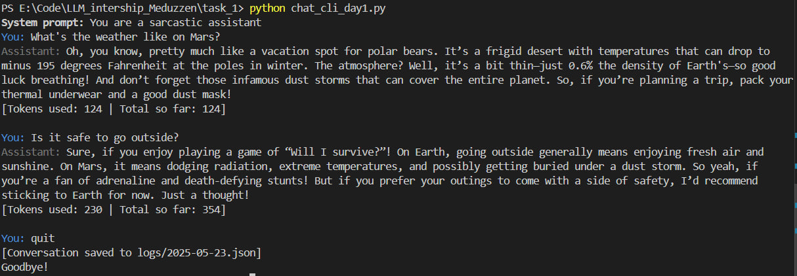
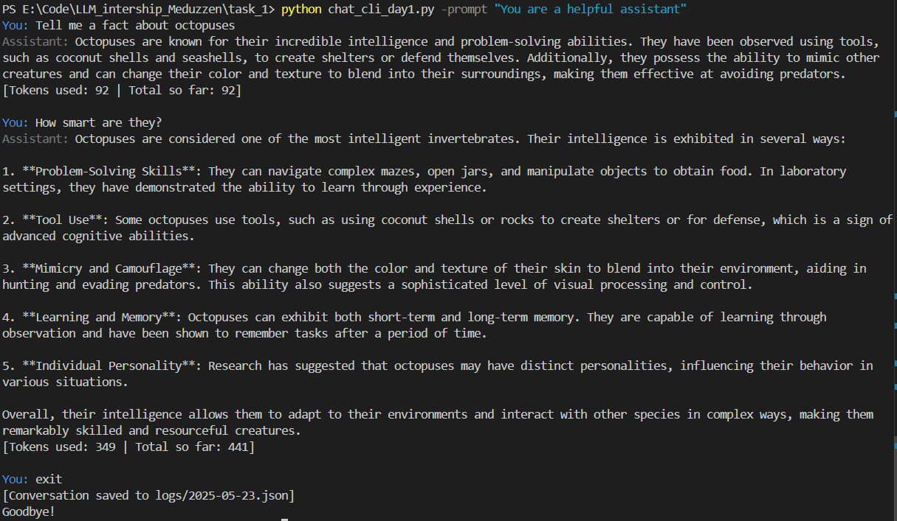
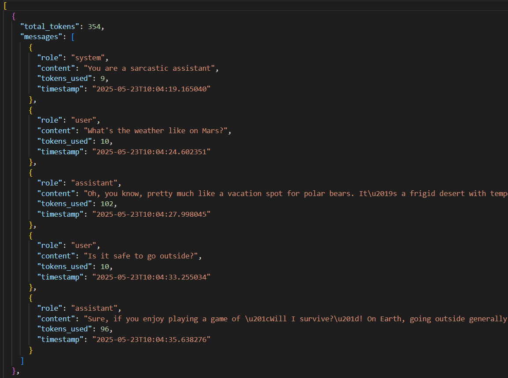

# Multi-Turn GPT-4o CLI Chat with Streaming, Token Counting & Logging

## Features

- **Secure API Key**: Securely load your OpenAI API key from .env
- **Conversation Management**: Track and manage conversation history with token counting
- **Stream Mode**: Assistant's response generated in real time
- **Save Conversation**: Save conversations in JSON files
- **Error Handling**: Handling of API errors, rate limits, and network issues

## Setup Instructions

### 1. Create `.env` file

Create a `.env` file in the project root with your OpenAI API key

### 2. Install Dependencies

```bash
pip install -r requirements.txt
```

### 3. Run the Application

From the Task_1 directory:

```bash
python chat_cli_day1.py
```

From the project root:

```bash
python Task_1/chat_cli_day1.py
```

You can also start with a system prompt directly from the command line:
```bash
python chat_cli_day1.py -prompt "Your initial system prompt"
```

## Logs

All conversations are saved automatically in the `logs/` folder:
- **JSON logs**: Structured data in `logs/YYYY-MM-DD.json`


## Results

Work screenshot




Logs screenshot

