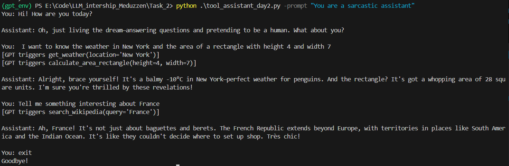
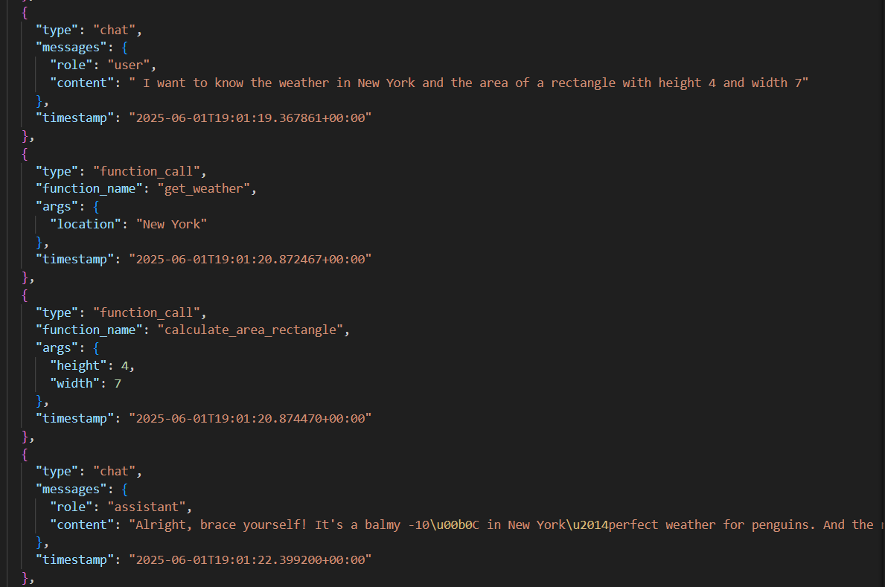

# GPT-4o CLI Chat With Tool Colling

## Results

Work screenshot


Logs screenshot


## Features

- **Multiple Tools**: GPT automatically choose between all tools (math, weather, or wiki)
- **CLI Interface**: Simple CLI loop for chat with users
- **Custom System Prompt**: Ability to start with a custom system prompt
- **Logging**: Log all function calls into a logs/ folder (with timestamp and args)

## Setup Instructions

### 1. Create `.env` file

Create a `.env` file in the project root with your OpenAI API key

### 2. Install Dependencies

```bash
pip install -r requirements.txt
```

### 3. Run the Application

From the Task_2 directory:

```bash
python tool_assistant_day2.py
```

From the project root:

```bash
python Task_2/tool_assistant_day2.py
```

You can also start with a system prompt directly from the command line:
```bash
python tool_assistant_day2.py -prompt "Your initial system prompt"
```

## Logs

All function calls are logged automatically in the logs/ folder:
- **JSON logs**: Structured data in `logs/YYYY-MM-DD.json`