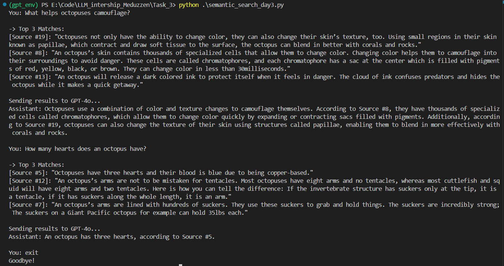

# A Local Semantic Search Engine Using OpenAI Embeddings + GPT-4o Query Enhancement

## Results

Work screenshot



Logs screenshot


## Features

- **OpenAI Embeddings**: Use OpenAI’s text-embedding-3-small API, normalize embeddings for cosine similarity
- **FAISS Index**: Local similarity search
- **GPT-4o Response**: Answer using information from the most relevant data
- **Markdown Logging**: All Q&A responses are logged to Markdown file
- **Looped Chat Mode**: Ask multiple questions in a continuous session

## Setup Instructions

### 1. Create `.env` file

Create a `.env` file in the project root with your OpenAI API key

### 2. Install Dependencies

```bash
pip install -r requirements.txt
```

### 3. Run the Application

From the Task_3 directory:

```bash
python semantic_search_day3.py
```

From the project root:

```bash
python Task_3/semantic_search_day3.py
```

## Logs

All conversations are saved in a Markdown file at logs/chat_log.md