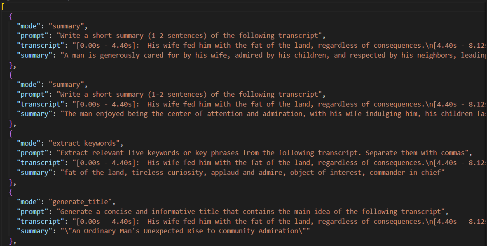

# Transcribe and Summarize Audio with Whisper + GPT-4o

## Results

--mode flag for different GPT tasks:


Multiple files:


--mode 'custom' for retrying different custom prompts:


Logs screenshot:



## Features

- **Whisper API**: Transcribes audio files using `whisper-1`
- **Summarization**: Generates summaries, titles, or keywords from transcripts
- **Custom Prompt Mode**: Add CLI loop for retrying different summarization prompts
- **Multi-file Support**: Transcribe & summarize multiple files in batch
- **JSON Logging**: Saves transcripts and summaries into `logs/YYYY-MM-DD.json`

## Setup Instructions

### 1. Create `.env` file

Create a `.env` file in the project root with your OpenAI API key

### 2. Install Dependencies

```bash
pip install -r requirements.txt
```

### 3. Run the Application

From the Task_4 directory:

```bash
python semantic_search_day4.py
```

From the project root:

```bash
python Task_4/semantic_search_day4.py
```

Or for different mode

Summary mode (default):

```bash
python semantic_search_day4.py --mode "summary"
```

Extract keywords mode:

```bash
python semantic_search_day4.py --mode "extract_keywords"
```

Generate title mode:

```bash
python semantic_search_day4.py --mode "generate_title"
```

Custom prompt mode:

```bash
python semantic_search_day4.py --mode "custom"
```

## Logs

Transcripts & summaries are saved to a JSON  in the `logs/` folder:
- **JSON logs**: Structured data in `logs/YYYY-MM-DD.json`