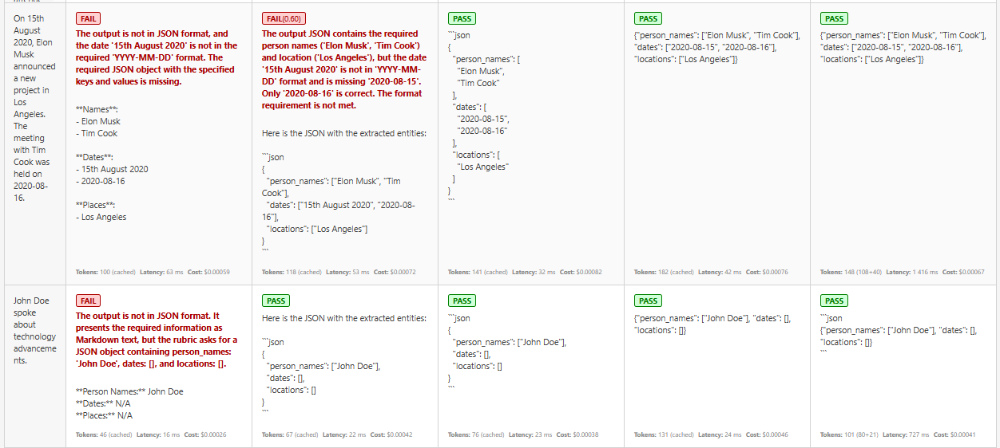

# Prompt Engineering with Testing, Structured Output, and Promptfoo

## Chosen Task

Extract person names, dates (in `YYYY-MM-DD` format), and locations from text. The model is expected to return a valid JSON object.

### Example Output:
```json
{
    "person_names": ["Bohdan"],
    "dates": ["2025-06-15"],
    "locations": ["Kyiv"]
}
```

## Prompts

1. Extract person names, dates, and places from the text below.

2. Return a JSON with keys: person_names, dates, locations. Extract entities from this text.

3. Extract all person names (just names), dates (YYYY-MM-DD), and all locations mentioned in the text. Return JSON with those 3 fields: person_names, dates, locations.

4. From the text below, extract:
{"person_names": [], "dates": [], "locations": []}
Exmaple: ...
Output: ...

6. You are an information extraction tool that returns data only in JSON format with this structure:
{"person_names": [], "dates": [], "locations": []}.
Make sure all dates are in YYYY-MM-DD. Include all names and places mentioned. Output only valid JSON.
Extract entities from the following text:

## Prompt Engineering Techniques Used

1. Basic Instruction - A simple task formulation without constraints.
2. JSON Structure Instruction - Specifies exact keys the JSON must contain.
3. Output Formatting Constraints - Defines the JSON structure and format of each field.
4. Few-shot Prompting - Show a sample input and expected output.
5. System Role Prompting - Gives the model a predefined role.

## Success Rate

### Testing in Python


### Promptfoo



