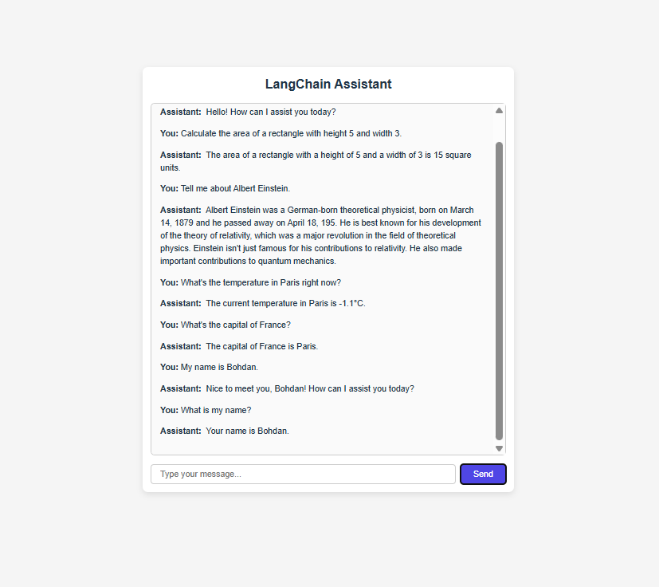

# LangChain Agent Assistant with Tool Use, FastAPI Backend & React Frontend

## Features

- **WebSocket Streaming**: WebSocket streaming responses from LangChain conversational agent
- **Conversation Memory**: Full conversation memory with windowed context
- **React Frontend**: React frontend with real-time chat UI
- **Health Check Endpoint**: Backend health check endpoint `/health`
- **Integrated Tools**: Tools integrated in LangChain agent

## Setup Instructions

### 1. Create `.env` file

Create a `.env` file in the project root with your OpenAI API key and model name to use

### 2. Install Dependencies

```bash
pip install -r requirements.txt
```

### 3. Run Backend Server

From the backend directory run:

```bash
uvicorn main:app --reload
```

### 4. Setup Frontend

From the frontend directory run:

```bash
npm install
npm run dev
```

## Results

