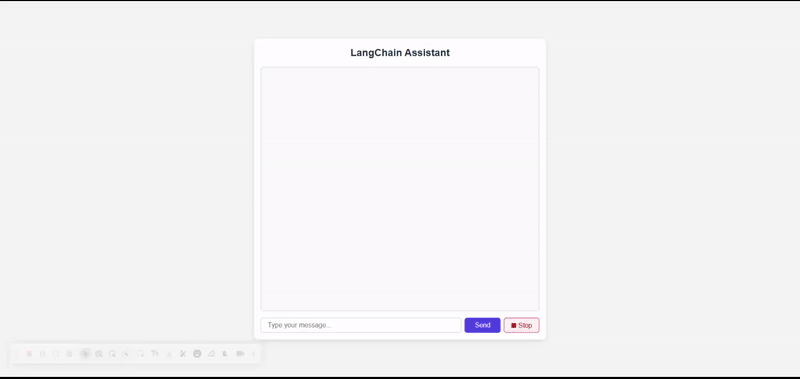
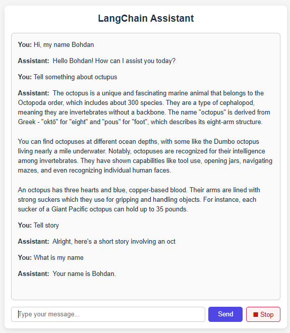
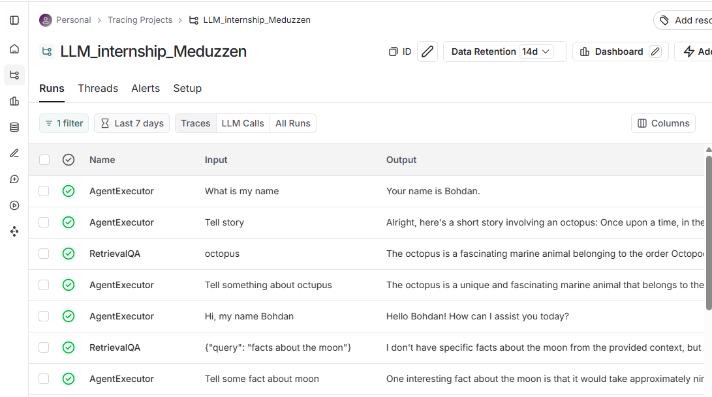

# LangChain Agent Assistant with Tool Use, FastAPI Backend & React Frontend

## Features

- **WebSocket Streaming**: WebSocket streaming responses from LangChain conversational agent
- **Conversation Memory**: Full conversation memory
- **React Frontend**: React frontend with real-time chat UI
- **Retrieval-Augmented Generation**: Uses FAISS vector store for document retrieval to enhance answers
- **Health Check Endpoint**: Backend health check endpoint `/health`
- **Integrated Tools**: Tools integrated in LangChain agent
- **Stop Button**: Allows interrupting the streaming response mid-way from the frontend

## Setup Instructions

### 1. Create `.env` file

Add the following to `.env` in the backend root directory:
```
OPENAI_API_KEY=your_openai_api_key
MODEL=your_gpt_model
LANGCHAIN_TRACING_V2=true
LANGCHAIN_API_KEY=your_langchain_api_key
LANGCHAIN_PROJECT=your_project_name
```

### 2. Install Dependencies

```bash
pip install -r requirements.txt
```

### 3. Run Backend Server

From the backend directory run:

```bash
uvicorn main:app --host 127.0.0.1 --port 8000
```

### 4. Setup Frontend

From the frontend directory run:

```bash
npm install
npm run dev
```

## Results

App work






Results of add document


Screenshot of LangSmith trace

